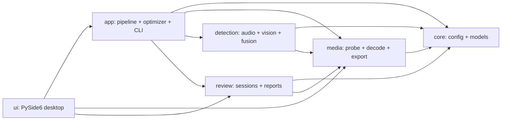

# 项目架构与复用指南

TennisVideoHelper 是一个桌面端多模态分析应用，但音频检测、视觉检测、媒体处理和业务界面不应彼此绑定。本次架构把它们拆成单向依赖的功能层，使算法可以脱离网球界面用于其他视频、声音或动作识别项目。

## 设计依据

- 延续 Python Packaging User Guide 推荐的 `src` 布局，避免从仓库根目录意外导入未安装代码。
- 参考 pyannote-audio 将可复用算法、管线和测试独立组织的方式。
- 参考 librosa 对源码、测试、文档和维护脚本的明确分区。
- 参考 Ultralytics Python 项目模板，把测试、文档、项目配置和自动化脚本作为一等目录。

参考链接：

- <https://packaging.python.org/en/latest/discussions/src-layout-vs-flat-layout/>
- <https://github.com/pyannote/pyannote-audio>
- <https://github.com/librosa/librosa>
- <https://github.com/ultralytics/template>

## 目录结构

```text
TennisVideoHelper/
├── assets/
│   ├── icons/                       # 桌面端与安装包图标
│   └── models/                      # 离线视觉模型
├── docs/
│   ├── architecture.md              # 当前架构与扩展规则
│   ├── design/                      # 算法和性能设计
│   └── development/                 # 历史实施记录
├── examples/
│   └── calibration/                 # 人工标注示例和校准说明
├── packaging/                       # PyInstaller 与 Inno Setup 配置
├── scripts/                         # 构建和资源生成脚本
├── src/tennis_video_helper/
│   ├── app/                         # 用例编排、CLI、优化器
│   ├── core/                        # 稳定配置与领域模型
│   ├── detection/                   # 可复用音频、视觉、融合算法
│   │   └── vision/                  # 姿态、球拍和推理后端
│   ├── media/                       # 探测、解码、导出、运行工具
│   ├── review/                      # 人工复核与报告
│   ├── ui/                          # 桌面界面
│   └── resources.py                 # 源码版与打包版资源解析
├── tests/                           # 与 src 结构镜像的测试
├── pyproject.toml
└── uv.lock
```

`runtime/`、`.venv/`、`build/`、`dist/` 和用户输出目录属于本地运行或生成内容，不是源码组成部分，并由 `.gitignore` 管理。

## 依赖方向



约束：

1. `core` 不导入 OpenCV、PyTorch、PySide6 或业务界面。
2. `media` 只负责文件发布、编解码和外部媒体工具，不做击球判定。
3. `detection` 输出通用事件，不负责创建候选文件夹或显示窗口。
4. `app` 通过 `PipelineServices` 注入检测、导出和报告实现，便于替换与测试。
5. `ui` 只调用应用用例和复核接口，不直接实现识别算法。

## 可复用扩展点

### 替换声音检测器

实现与 `detection.audio.detect_audio_events` 相同的输入输出签名，再通过 `app.pipeline.PipelineServices.replace` 注入：

```python
from tennis_video_helper.app.pipeline import PipelineServices

services = PipelineServices.defaults().replace(
    detect_audio_events=my_audio_detector,
)
```

这适合复用到羽毛球触球、工业冲击声或其他瞬态检测任务。

### 替换视觉动作检测器

视觉入口位于 `detection.vision.analyzer.analyze_video`。新的姿态模型、目标检测器或动作分类器只需返回 `core.models.VisualEvent`，无需依赖 GUI。

### 替换融合和切段策略

`detection.fusion` 只接收音频事件、视觉事件和配置，输出融合事件与时间段。其他运动可以保留媒体和管线层，仅替换融合规则。

### 替换媒体后端

`media.decoder`、`media.exporter` 和 `media.runtime` 隔离了 NVDEC、NVENC、OpenCV 与 FFmpeg。未来可增加 Linux、CPU-only 或云端媒体实现，而不修改检测算法。

## 资源管理

`resources.asset_path` 按以下顺序寻找模型和图标：

1. 调用者传入的明确文件路径；
2. `TVH_MODEL_DIR` 或 `TVH_ICON_DIR`；
3. PyInstaller 打包资源；
4. 可执行文件旁的资源；
5. 源码仓库的 `assets/`。

因此模型不再依赖当前工作目录，脚本、测试、源码运行和安装版使用同一套查找规则。

## 开发检查

```powershell
uv sync --extra dev
uv run pytest -q
uv run tennis-video-helper --help
uv run tennis-video-helper-gui
```

修改打包目录后，还应执行 PyInstaller 配置解析和便携版构建检查。
